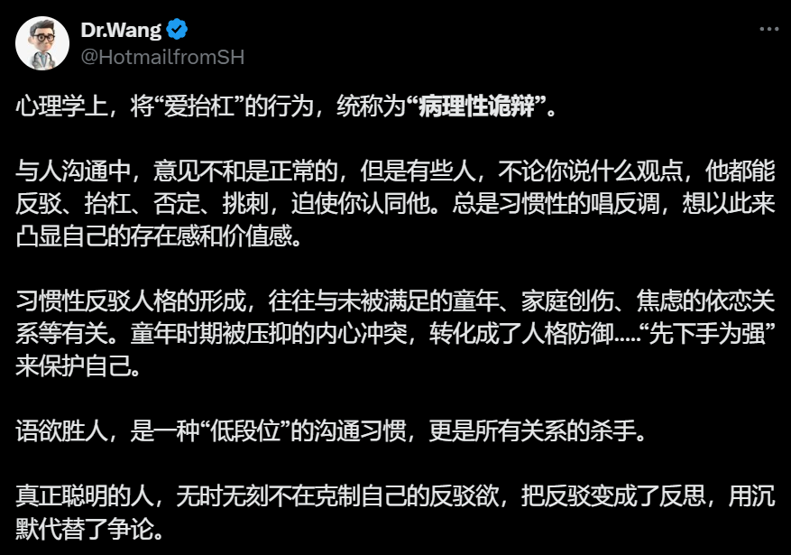

我们为什么越来越难以理解不同的声音？这个问题其实折射出这个时代的某种精神困境。

过去，人们虽然也有分歧，但至少还能坐下来交谈。现在呢？社交媒体把世界切割成无数个回音室，算法像贴心的管家，只给我们看想看的、只听想听的。我们被自己的偏好圈养，渐渐丧失了理解异见的能力。更可怕的是，我们开始把观点分歧等同于人格对立："你不认同我？那你就是坏人"。    
  
这种思维模式正在摧毁理性对话的空间。看看现在的网络争论，有几个人是真正在讨论问题？大多数人只是在表演自己个人的立场，在寻找共鸣，在用最激烈的语言标榜自己有多么多么深的理解。不再追求真相，而是追求"我说得爽"；不再思考对方观点的合理性，而是忙着给异见者贴标签。    
  
但理解不等于认同。一个健康的社会需要包容不同的声音，就像生态圈需要多样的生物。试着在下次遇到不同观点时，先别急着反驳，问问自己："他为什么这么想？他的经历和我有什么不同？"也许你会发现，那些你曾经看不起的观点，背后也有它合理的逻辑。

保持开放包容的心态不是软弱，而是一种智慧。毕竟，如果我们只听得进和自己一样的声音，那和聋子有什么区别？真正的成长，往往始于我们能够坦然面对那些让我们不舒服的观点。

下面引用一则贴文：

引图1
